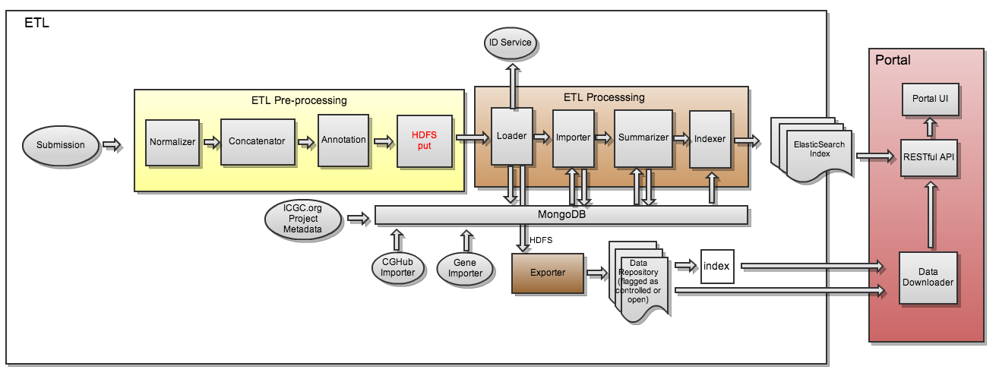

ICGC DCC ETL Pipeline Description
===

- [Overview](#overview)
- [Concatenator](#concatenator)
- [Normalizer](#normalizer)
- [Annotator](#annotator)
- [Loader](#loader)
- [Exporter](#exporter)
- [Importer](#importer)
- [Summarizer](#summarizer)
- [Indexer](#indexer)

##  Overview

This document briefly describes the DCC ETL workflow. 

The ETL project consumes clinical data [submitted](http://docs.icgc.org/submission/about/) by the users and prepares it to be consumed by the [DCC Portal](https://dcc.icgc.org/). Its source code could be found in the [DCC Portal repository.](https://github.com/icgc-dcc/dcc-portal)

The ETL diagram depicts DCC ETL components and their interaction.

*ETL diagram*

ETL project consists of 8 components which are executed sequentially to perform various transformations on the submitted data.

##  Concatenator

Reads submission data and uncompresses the data so it becomes compression agnostic. Ensure output one file per file types. For example, it can take multiple `ssm_m` files, but will output just one file

##  Normalizer

This step is performed by [DCC Submission Validation](https://github.com/icgc-dcc/dcc-submission/tree/develop/dcc-submission-validator) component. During this step `marking`, `mutation` and `observation_id` fields are added to `ssm_p` files. `sgv_p` files are enriched with `observation_id` field.

Normalizer strips out confidential fields (replaced with empty string) based on dictionary when 'filter_controlled' option is used

##  Annotator

Annotator is responsible for annotating the variant with SO terms and predicts the effects of variants on genes (such as amino acid changes) from `ssm_p` and `sgv_p` files. Internally it uses [SnpEff project](http://snpeff.sourceforge.net/) to do this job.

##  Loader

Loader prepares submitted clinical data for further processing by executing following steps: 

- Performs joins for clinical data (donor/specimen/sample), and each of the experimental data types.
- Removes/obfuscates controlled data which were used by the [Annotator](#annotator).
- Generates/assigns stable Identifiers for major entities, such as, `Donor`, `Specimen`, `Sample`, `SSM mutation`.
- Prepares artifacts to be used by [DCC Exporter](../dcc-etl-exporter/README.md)
- Loads data into a DCC release MongoDB to be consumed by [DCC Summarizer](../dcc-etl-summarizer/README.md)

After the loader step finishes workflow branches to [Exporter](#exporter) and [Importer](#importer) which can be executed in parallel.

##  Exporter

Exporter uploads files produced by [Loader](#loader) to `HBase`. The files are available for download on the [DCC Portal](https://dcc.icgc.org/releases).

Exporter separates required files to `open access` available to public and `controlled access` which are available only to those approved by the [DACO office](https://icgc.org/daco).

##  Importer

Importer performs Functional Analysis through Hidden Markov Models (FATHMM). More detailed information could be found in the [FATHMM documentation](Fathmm.md).

##  Summarizer

Summarizer generates different metrics on various entities such as:

- Available observation types for a donor.
- What age group a donor belongs to?
- Number of donors in a particular project.
- Number of mutations for a project.

etc.

##  Indexer

Indexer reads a DCC release MongoDB database, transforms the normalized documents into ElasticSearch documents for indexing and indexes them into an ElasticSearch cluster. It also, backups the prepared ElasticSearch documents for later reuse.

[Simple somatic mutation aggregated data](https://dcc.icgc.org/releases/current/Summary) is produced at this step.